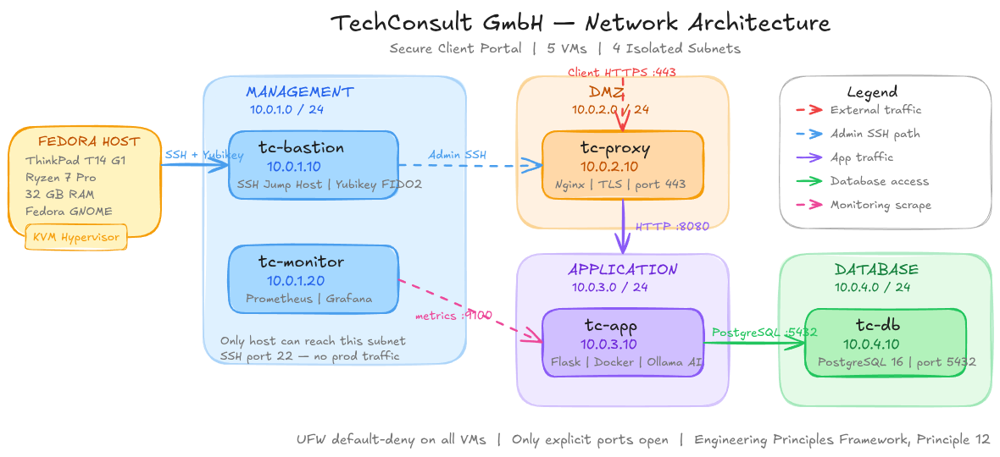

<div align="center">

# TechConsult GmbH
### Secure Client Portal Infrastructure

**Infrastructure Engineering Bootcamp &nbsp;·&nbsp; 8 Sprints &nbsp;·&nbsp; 115 Hours**

[](.)
[](.)
[](.)
[](.)

</div>

---

## What This Is

This repository documents the end-to-end design and build of a production-grade infrastructure for a fictional German IT consulting firm. It is not a tutorial walkthrough. It is a working, deployable system built from first principles — version-controlled, documented, and explainable at every layer.

Every architectural decision maps to a principle from the 5-Pillar IT Engineering framework. Every sprint produces a tangible deliverable committed to this repository. By the end, this infrastructure runs a secure client portal with network segmentation, hardware authentication, full observability, Ansible automation, and a locally hosted AI model — all on a single ThinkPad.

> **"The lab IS the interview."**

---

## Architecture



> *Full topology: 5 VMs across 4 isolated KVM subnets. Editable source: [`diagrams/network-topology`](diagrams/network-topology)*

The lab simulates a standard 3-tier production network with a dedicated management plane. Four isolated subnets enforce security boundaries at the network level — not the application level.

| VM | Hostname | IP | Subnet | Role |
|:---|:---|:---|:---|:---|
| VM1 | `tc-bastion` | `10.0.1.10` | Management | SSH jump host · Yubikey FIDO2 |
| VM2 | `tc-proxy` | `10.0.2.10` | DMZ | Nginx · TLS termination |
| VM3 | `tc-app` | `10.0.3.10` | Application | Flask in Docker · Ollama AI |
| VM4 | `tc-db` | `10.0.4.10` | Database | PostgreSQL 16 |
| VM5 | `tc-monitor` | `10.0.1.20` | Management | Prometheus · Grafana |

```
CLIENT
  │
  │  HTTPS :443
  ▼
┌─────────────────────────────────────────────────────────────┐
│  DMZ  10.0.2.0/24                                           │
│  tc-proxy  10.0.2.10   [Nginx — TLS termination]            │
└──────────────────────────┬──────────────────────────────────┘
                           │  HTTP :8080
                           ▼
┌─────────────────────────────────────────────────────────────┐
│  APPLICATION  10.0.3.0/24                                   │
│  tc-app  10.0.3.10   [Flask · Docker · Ollama :11434]        │
└──────────────────────────┬──────────────────────────────────┘
                           │  PostgreSQL :5432
                           ▼
┌─────────────────────────────────────────────────────────────┐
│  DATABASE  10.0.4.0/24                                      │
│  tc-db  10.0.4.10   [PostgreSQL 16 — app-only access]        │
└─────────────────────────────────────────────────────────────┘

FEDORA HOST → Yubikey SSH :22 → tc-bastion → all VMs via ProxyJump
tc-monitor  → node_exporter :9100 → all 5 VMs (Prometheus scrape)
```

---

## Design Principles

Every decision in this lab has a business justification, not just a technical one. The architecture is built against the 5-Pillar IT Engineering framework.

| Principle | Implementation |
|:---|:---|
| **#12 — Default-Deny Networking** | UFW on every VM. Only documented, explicitly required ports are open. |
| **#14 — Addressing is Architecture** | Subnets planned before any VM was created. IP scheme documented in Git first. |
| **#18 — Least Privilege Always** | No sudo for VM management. No root SSH. libvirt group handles hypervisor ops. |
| **#21 — Segment Everything** | 4 isolated subnets. A compromised web server cannot directly reach the database. |
| **#22 — Defence-in-Depth** | Identity (Yubikey) + network segmentation + OS hardening + encrypted transport. |
| **#27 — If You Can't See It, You Can't Secure It** | Prometheus scrapes all 5 VMs. Grafana dashboards expose real-time metrics. |
| **#32 — Infrastructure is Code** | Everything in Git. Ansible rebuilds the full lab from scratch in under 30 minutes. |

---

## Sprint Breakdown

### ✅ Sprint 0 — Git + Network Architecture
**`12 hours`** &nbsp;|&nbsp; **Completed**

Established version control and designed the full network topology before touching a single VM. The architecture diagram, subnet plan, and IP assignments were committed to Git first. This is how production infrastructure is built.

**Deliverables**
- Public GitHub repository with clean, descriptive commit history
- [`docs/network-plan.md`](docs/network-plan.md) — subnet design, VM inventory, traffic flows
- [`diagrams/network-topology.excalidraw`](diagrams/network-topology.excalidraw) — editable source
- [`diagrams/network-topology.png`](diagrams/network-topology.png) — rendered export
- Project directory structure for all future sprints

*Bible Principles applied: #6 Know the OS Beyond the GUI · #10 Follow the Packet · #14 Addressing is Architecture*

---

### 🔄 Sprint 1 — Linux Server Administration + KVM Virtualization
**`16 hours`** &nbsp;|&nbsp; **In Progress**

Built the first VM from the command line, established SSH key-based access, hardened the server before deploying any services, and produced a professional deployment report with real system metrics.

**Deliverables**
- `practice-vm` — Ubuntu Server 24.04 LTS, headless, SSH-only
- ed25519 SSH key authentication (no passwords)
- UFW default-deny firewall with documented ruleset
- [`sprint-1-server-report.md`](sprint-1-server-report.md) — real metrics, before/after hardening comparison

*Bible Principles applied: #6 · #7 Know What Healthy Looks Like · #8 Design for Failure · #9 Repeatable Configs · #23 Reduce Attack Surface*

---

### ⬜ Sprint 2 — Docker Fundamentals
**`15 hours`**

Builds the TechConsult Flask portal application, containerizes it, and wires it to PostgreSQL using Docker Compose. This compose file becomes the prototype deployed to production VMs in Sprint 4.

**Deliverables**
- Custom Docker image of the TechConsult Flask portal
- Working `docker-compose.yml` (Flask + PostgreSQL)
- Documentation of container networking model and lifecycle

*Bible Principles applied: #9 · #32 Infrastructure is Code · #37 Prefer Managed Services When Understood*

---

### ⬜ Sprint 3 — Network Segmentation + Firewalls
**`15 hours`**

Creates the four isolated KVM networks, assigns static IPs via netplan, and implements role-specific UFW rulesets. Proves segmentation actually works — blocked paths are tested and confirmed blocked.

**Deliverables**
- 4 isolated KVM virtual networks with static IP assignment
- UFW ruleset per VM with documented business justification for every rule
- Connectivity test report proving segmentation is enforced
- SSH ProxyJump bastion configuration

*Bible Principles applied: #10 · #11 Debug in Layers · #12 · #13 Tools Give Visibility · #21*

---

### ⬜ Sprint 4 — Full Lab Deployment: TechConsult Portal
**`22 hours`**

Deploys all five VMs simultaneously and connects the full application stack. Nginx terminates TLS and proxies to Flask. Flask queries PostgreSQL. Prometheus scrapes everything. The lab becomes a live, working system.

**Deliverables**
- End-to-end HTTPS portal accessible through Nginx reverse proxy
- PostgreSQL backend storing real application data
- Prometheus + Grafana monitoring dashboards with live metrics from all 5 VMs

*Bible Principles applied: #1 Business Over Tech Puzzles · #3 Think in Systems · #7 · #15 Assume Breach · #21 · #27*

---

### ⬜ Sprint 5 — Yubikey Hardware Authentication
**`8 hours`**

Adds physical hardware as an authentication factor. SSH to the bastion host requires a Yubikey touch — a software credential alone is no longer sufficient. Documents the complete security architecture and trust boundaries.

**Deliverables**
- FIDO2 ed25519-sk SSH key pair bound to Yubikey 5C NFC
- Hardware-gated bastion access (physical touch required)
- Security architecture documentation with trust boundary diagrams

*Bible Principles applied: #15 · #17 Never Trust Always Verify · #18 · #22 · #24 Identity is the Perimeter*

---

### ⬜ Sprint 6 — Ansible Automation
**`12 hours`**

Converts every manual configuration step into idempotent Ansible playbooks. A single `site.yml` rebuilds the entire lab from bare VMs. This is the proof of Principle 9: configurations must be repeatable.

**Deliverables**
- Full Ansible inventory + role-based playbooks + `group_vars`
- Master `site.yml` that orchestrates complete lab rebuild
- Documented full rebuild from bare VMs in under 30 minutes

*Bible Principles applied: #9 · #30 The Rule of Two · #31 Standardise Before Automating · #32 · #33 Automation Must Be Safe*

---

### ⬜ Sprint 7 — AI Infrastructure + Final Documentation
**`15 hours`**

Deploys Mistral Nemo 12B — an EU-developed model — via Ollama on the app server. Adds AI deployment to Ansible automation. Produces the final portfolio-ready documentation.

**Deliverables**
- Local AI inference endpoint (Ollama + Mistral Nemo 12B)
- Ansible-automated AI service deployment integrated into `site.yml`
- Portfolio-ready README, final architecture diagram, Grafana screenshots

*Bible Principles applied: #1 · #32 · #37 · #49 One Evolving Project · #51 Communication is Engineering · #52 The Documentation Trinity*

---

## Technology Stack

| Layer | Technology |
|:---|:---|
| **Host** | Fedora GNOME · ThinkPad T14 G1 · Ryzen 7 Pro · 32GB RAM |
| **Virtualization** | KVM / QEMU · libvirt · virsh CLI |
| **Guest OS** | Ubuntu Server 24.04 LTS (headless, SSH-only) |
| **Containers** | Docker · Docker Compose |
| **Web / Proxy** | Nginx (reverse proxy + TLS termination) |
| **Application** | Flask (Python) |
| **Database** | PostgreSQL 16 |
| **Monitoring** | Prometheus · Grafana · node_exporter |
| **Automation** | Ansible |
| **Security** | UFW · ed25519 SSH keys · Yubikey 5C NFC (FIDO2) |
| **AI Runtime** | Ollama · Mistral Nemo 12B |
| **Version Control** | Git · GitHub CLI (`gh`) |
| **Diagramming** | Excalidraw |

---

## Repository Structure

```
lab/
├── diagrams/
│   ├── network-topology.excalidraw   # Editable source
│   └── network-topology.png          # README embed
├── docs/
│   ├── network-plan.md               # Subnet design + VM inventory
│   └── security-architecture.md     # Trust boundaries (Sprint 5)
├── ansible/
│   ├── inventory/                    # Host definitions
│   ├── playbooks/                    # Role-specific playbooks
│   └── group_vars/                   # Per-role variables
├── docker/
│   ├── Dockerfile                    # TechConsult Flask portal
│   └── docker-compose.yml            # Flask + PostgreSQL
├── scripts/                          # Utility scripts
├── sprint-1-server-report.md         # Sprint 1 deliverable
└── README.md
```

---

## Hour Summary

| Sprint | Focus | Hours | Status |
|:---|:---|:---:|:---|
| Sprint 0 | Git + Network Architecture | 12 | ✅ Completed |
| Sprint 1 | Linux + KVM Virtualization | 16 | 🔄 In Progress |
| Sprint 2 | Docker Fundamentals | 15 | ⬜ |
| Sprint 3 | Network Segmentation + Firewalls | 15 | ⬜ |
| Sprint 4 | Full Lab: TechConsult Portal | 22 | ⬜ |
| Sprint 5 | Yubikey Hardware Authentication | 8 | ⬜ |
| Sprint 6 | Ansible Automation | 12 | ⬜ |
| Sprint 7 | AI Infrastructure + Final Docs | 15 | ⬜ |
| **Total** | | **115** | **8–10 weeks at 2–3h/day** |

---

## Post-Bootcamp Path

```
NOW       →  CCNA 200-301
              Lab covers ~60–65% of exam content.
              Remaining 35%: Cisco IOS syntax via Packet Tracer.
                   │
                   ▼
PHASE 1   →  Junior Infrastructure Engineer
              International companies / MSPs in Germany
              Bechtle · Computacenter · NTT Data · T-Systems · Capgemini
                   │
                   ▼
PHASE 2   →  CCNP + 2 years experience
              Gulf markets — Dubai · Abu Dhabi
                   │
                   ▼
PHASE 3   →  AWS / Azure + CKA
              USA · AI Infrastructure / Platform Engineering
```

---

<div align="center">

*Built on the 5-Pillar IT Engineering framework.*
*Tools change. Principles don't.*

</div>
